<div align="center">



<a href="https://git.io/typing-svg">
  
</a>

<br>


</div>


<h2 align="center"> Hola, soy Horussxs</h2>

<p align="center">
Me gusta convertir ideas en páginas web <b>simples, rápidas y bonitas</b>.<br>
Creo en el minimalismo: <i>menos ruido, más intención</i>.
</p>

<div align="center">

</div>


## 👾 `sobre_mi`

<table align="center">
<tr>
<td width="50%" valign="top">

```yaml
nombre:    Horussxs
rol:       Web Developer
enfoque:   Minimalista y creativo
trabajando_en: Webs para clientes reales
aprendiendo:
  - JavaScript moderno
  - Diseño de interfaces
  - Buenas prácticas
  - Animaciones CSS
```

</td>
<td width="50%" valign="top">

- 🔭 Proyectos web para clientes reales
- 🌱 Aprendiendo algo nuevo cada semana
- 🎨 Obsesionado con los detalles visuales
- ⚡ Si se ve bien y carga rápido, ya me ganaste
- 💬 Pregúntame sobre **HTML, CSS y diseño web**
- 😄 Dato curioso: mi ojo es el de Horus 👁️

</td>
</tr>
</table>


## 🛠️ `stack`

<p align="center">
  
</p>

<p align="center">
  
  
  
  
  
  
  
  
</p>

### 🎯 Nivel de dominio

<p align="center">
  
  
  
  
  
</p>


## 📊 `stats`

<p align="center">
  
  
</p>

<p align="center">
  
</p>

### 🏆 Trofeos

<p align="center">
  
</p>


## 📈 `actividad`

<p align="center">
  
</p>

<p align="center">
  
</p>


## 🎲 `random`

<p align="center">
  
</p>

<p align="center">
  
</p>


<div align="center">


</div>
